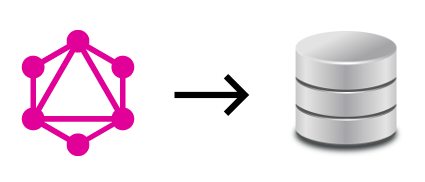

---
## GraphQL as a Database Query Language

#### Matthew Morris
#### April 25, 2018
---
### About Me

* Linguist at Lymba Corporation
* Many other hats: technical writer, QA tester, data wrangler, programmer, & mechanical Turk
* At work: Python & shell for data transformation & task automation, occasionally some Java
* On my own time: Ruby, Crystal, Erlang, Elixir, Prolog, or whatever catches my fancy
* Graph enthusiast 
---
### What Lymba Does 

* Natural language processing
* Deep semantic analysis of text
* Knowledge extraction (entities and relations)
* Output to a semantic graph 
---
### What Lymba Does: Plain Text Input
---
### What Lymba Does: Entity Recognition 
---
### What Lymba Does: Relation Extraction
---
### What Lymba Does: RDF Triple Output
---
### What Lymba Does: RDF Triple Stores and Graph Databases
---
### What Is A Graph Database?
---
### Underlying Storage Mechanisms

* Native graph
* Document database
* Relational database
---
### Labeled Property Graph vs. RDF
---
### Graph Query Languages

* SPARQL (W3C)
* Gremlin (Apache Software Foundation)
* Cypher (Neo4j)
* GraphQL (Facebook)
---
### Neo4j

* The original "graph database"
* Native property graph database written in Java
* Greatest mindshare in the graph database market
---
### Neo4j and GraphQL
---
### Neo4j and the "GRANDstack"

* GraphQL
* React
* Apollo
* Neo4j Database
---
### Dgraph
---
### Dgraph and GraphQL
---
### GraphQL+-
---
### Querying Dgraph
---
### Other Databases - Prisma Database Connector
